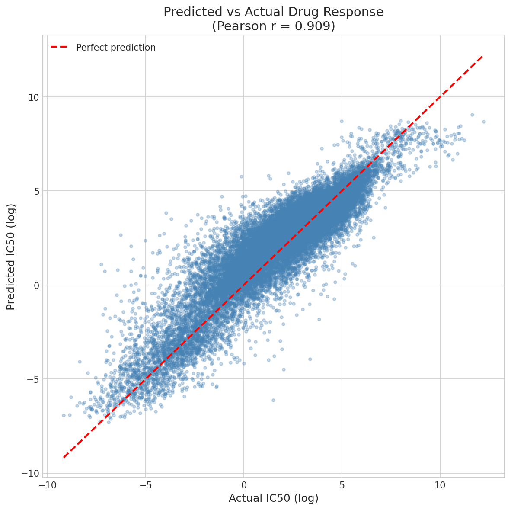
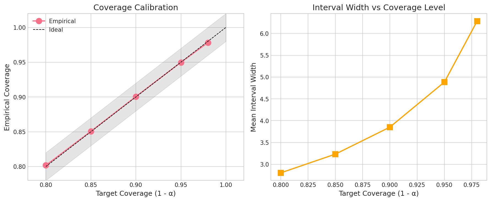
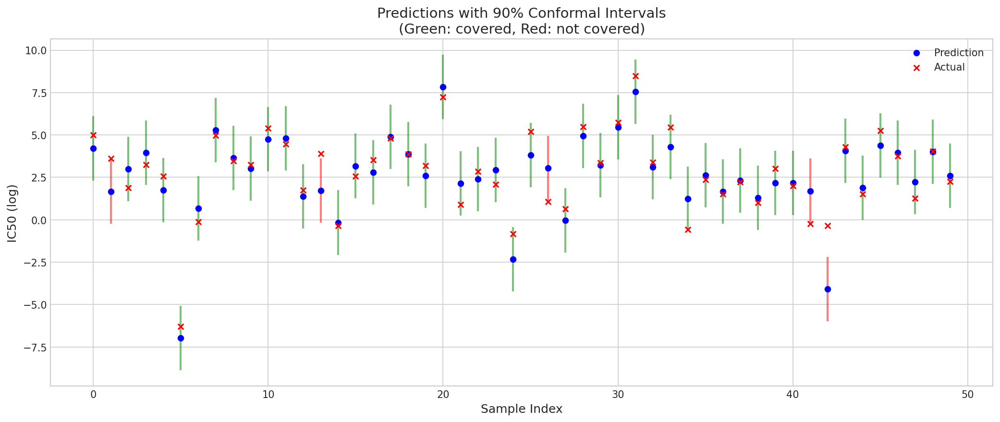
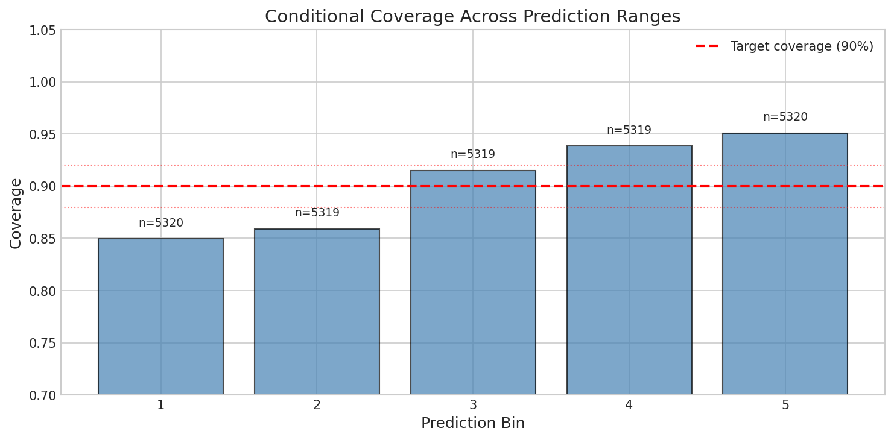
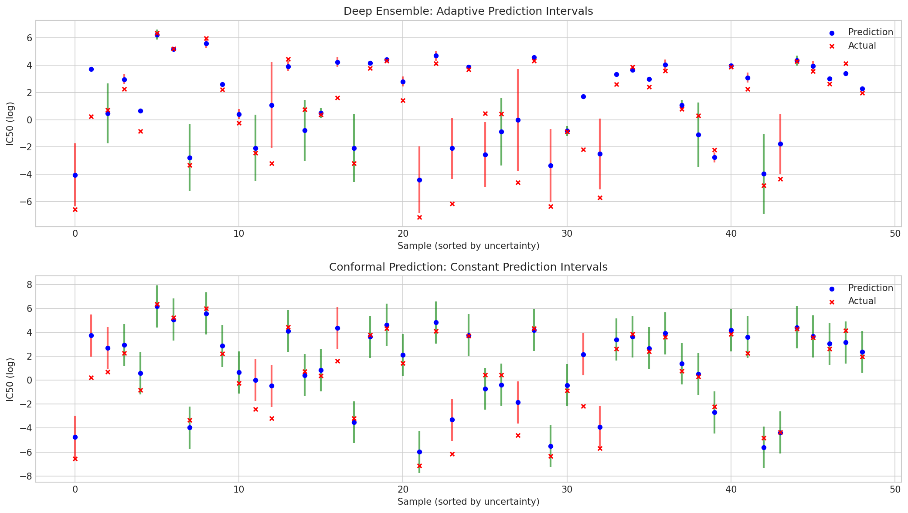

# Uncertainty-Aware Cancer Drug Response Prediction

[](LICENSE)
[](https://www.python.org/)
[](https://pytorch.org/)
[](https://pytorch-geometric.readthedocs.io/)

*Predicting cancer drug sensitivity (log IC50) for drug and cell-line pairs on GDSC1 with a graph neural network, and wrapping every prediction in split conformal prediction to obtain intervals with a distribution-free coverage guarantee. MC dropout and a deep ensemble are included as uncertainty baselines to show why a calibrated guarantee matters.*

## At a glance

The point predictor reaches a Pearson correlation of 0.909 between predicted and measured log IC50, competitive for GDSC1 regression. On top of it, split conformal prediction produces intervals whose empirical coverage matches the target level within a fraction of a percent at every level tested, a guarantee that holds regardless of the model or data distribution. The same setup exposes MC dropout as badly miscalibrated (about 49% coverage at a 90% target), which is the core argument for the conformal approach.

## Table of contents

- [Motivation](#motivation)
- [Data](#data)
- [Results](#results)
- [Figures](#figures)
- [Methods](#methods)
- [Repository structure](#repository-structure)
- [Reproducibility](#reproducibility)
- [Installation](#installation)
- [Usage](#usage)
- [Limitations and future work](#limitations-and-future-work)
- [Citation](#citation)
- [License](#license)

## Motivation

A model that ranks drug and cell-line pairs by predicted sensitivity is only useful for prioritizing experiments if it also says how much each prediction can be trusted. A point estimate of log IC50 gives no way to separate a confident call from a guess, and a confidently wrong prediction wastes bench time. The usual ways of extracting uncertainty from a neural network, such as MC dropout or deep ensembles, produce heuristic estimates with no formal guarantee of calibration. This project keeps a standard, well-performing GNN regressor as the point predictor and adds a thin conformal layer that converts its residuals into intervals with a provable, finite-sample coverage guarantee, requiring only that the calibration and test data are exchangeable. MC dropout and a deep ensemble are run alongside it as reference points.

## Data

GDSC1 (Genomics of Drug Sensitivity in Cancer), accessed through [Therapeutics Data Commons](https://tdcommons.ai/). It contains 177,310 drug and cell-line sensitivity measurements spanning 208 drugs and 958 cell lines, with log IC50 as the response and roughly 89% of all possible drug and cell-line combinations covered. Each drug is given as a SMILES string and each cell line as a 17,737-gene expression profile. A 70 / 15 / 15 split yields 124,117 training, 26,596 calibration, and 26,597 test samples, with the calibration split held strictly separate so the conformal guarantee stays valid.

## Results

All numbers below come from the notebook run with a fixed seed of 42.

| Metric | Value |
|---|---|
| RMSE | 1.184 |
| MAE | 0.876 |
| Pearson r | 0.909 |
| Spearman rho | 0.889 |
| Coverage (90% target) | 90.2% |
| Mean interval width | 3.795 |

Coverage is tightly calibrated at every level tested, and interval width grows smoothly with the confidence level, the expected accuracy-versus-certainty trade-off.

| Target coverage (1 - alpha) | Empirical coverage | Mean interval width |
|---|---|---|
| 80% | 80.2% | 2.804 |
| 85% | 85.1% | 3.233 |
| 90% | 90.1% | 3.852 |
| 95% | 95.0% | 4.885 |
| 98% | 97.8% | 6.283 |

A two-sided binomial test on the 90% intervals gives p = 0.18, so the observed coverage is statistically indistinguishable from the target.

**Why conformal over MC dropout.** With 50 stochastic forward passes and 90% nominal intervals, MC dropout reaches only about 48.6% empirical coverage, roughly half the target, and shows a weak rank correlation between its estimated uncertainty and the actual error (Spearman rho near 0.11). It is both miscalibrated and a poor guide to where the model errs. Split conformal recovers the guarantee MC dropout misses, at a single forward pass instead of fifty. A deep ensemble is also trained as a stronger uncertainty baseline; the repository includes its training, model-agreement, and uncertainty plots, along with a direct comparison of ensemble and conformal intervals.

**Conditional coverage.** Coverage is not perfectly uniform across the prediction range. Binning test predictions into five groups, empirical coverage runs from roughly 85% in the lowest-prediction bin to about 95% in the highest. This is a known property of vanilla split conformal, which guarantees marginal coverage but not conditional coverage, and it is reported openly rather than hidden. It points toward locally adaptive or normalized conformal variants as a natural next step.

## Figures

| | |
|---|---|
|  |  |
| **Predictions.** Predicted versus measured log IC50 on the test set (Pearson r = 0.909). | **Coverage calibration.** Empirical coverage tracks the target at every level, and interval width rises smoothly with confidence. |
|  |  |
| **Sample intervals.** 90% conformal intervals on example test predictions; green intervals cover the true value, red do not. | **Conditional coverage.** Marginal coverage holds, but per-bin coverage drifts from ~85% to ~95% across the prediction range, the marginal-versus-conditional gap. |



**Ensemble versus conformal intervals.** A direct comparison of the two uncertainty approaches on the same predictions, contrasting the deep ensemble's heuristic spread with the conformal intervals that carry a coverage guarantee.

## Methods

**Molecular featurization.** Each drug SMILES string is parsed with RDKit into a molecular graph. Every atom carries a 69-dimensional feature vector: a one-hot atom-type encoding over 44 elements, one-hot degree, one-hot formal charge, one-hot hybridization state, an aromaticity flag, and a normalized hydrogen count. Bonds become undirected edges.

**Drug encoder.** A 3-layer graph convolutional network with residual connections and batch normalization operates on the atom features, and a graph-level embedding is formed by summing mean and max pooling.

**Cell-line encoder.** The 17,737-gene expression vector is standardized and passed through an MLP that compresses it to a dense embedding matching the drug embedding dimension.

**Prediction head.** The drug and cell embeddings are concatenated and fed to an MLP that outputs a scalar log IC50. The full model has roughly 4.71M parameters.

**Training.** Mean squared error loss, Adam at a 1e-3 learning rate, ReduceLROnPlateau scheduling, gradient clipping at norm 1.0, and early stopping on the calibration split with a patience of 15 epochs; training stopped early near epoch 45.

**Conformal layer.** Split conformal prediction with absolute-residual nonconformity scores. The interval half-width is the finite-sample-corrected empirical quantile of the calibration residuals at level ceil((n + 1)(1 - alpha)) / n, giving q around 1.90 at alpha = 0.1. Because the quantile is computed only on the calibration split, which is disjoint from training, the coverage guarantee holds.

**Uncertainty baselines.** MC dropout (50 stochastic passes) and a deep ensemble are evaluated against the conformal intervals to compare calibration and cost.

## Repository structure

```
.
├── cancer_drug_response_conformal.ipynb
├── figures/                          # exported plots
├── results/
│   ├── test_metrics.csv
│   ├── coverage_analysis.csv
│   ├── predictions.csv
│   ├── ensemble_predictions.csv
│   ├── experiment_summary.json
│   └── results_table.tex
├── requirements.txt
├── .gitignore
├── LICENSE
└── README.md
```

The cached GDSC pickle and the model checkpoints (`*.pt`) are large and reproducible, so they are left untracked (see `.gitignore`). GDSC1 is re-downloaded automatically by TDC, and checkpoints regenerate on a rerun.

## Reproducibility

Developed in a GPU notebook environment (NVIDIA L4). A single seed of 42 is set for PyTorch and NumPy, and the data splits are seeded, so the reported numbers reproduce on a rerun. GDSC1 downloads automatically through Therapeutics Data Commons on first run, with a batch size of 128.

## Installation

```bash
git clone https://github.com/Yogarajan12/conformal-drug-response.git
cd conformal-drug-response
python -m venv .venv && source .venv/bin/activate
pip install -r requirements.txt
```

If the default wheels do not resolve, install `torch` and `torch-geometric` first with the build matching your CUDA or CPU setup, following the official [PyTorch](https://pytorch.org/get-started/locally/) and [PyG](https://pytorch-geometric.readthedocs.io/en/latest/install/installation.html) instructions, then install the rest of `requirements.txt`.

## Usage

Open the notebook and run it top to bottom:

```bash
jupyter lab cancer_drug_response_conformal.ipynb
```

GDSC1 downloads automatically on first run. The notebook then handles exploratory analysis, molecular featurization, model training with early stopping, conformal calibration across five alpha levels, the MC-dropout and deep-ensemble comparisons, statistical tests on coverage, and export of all figures and metrics.

## Limitations and future work

The random split measures interpolation performance rather than generalization to unseen drugs or unseen cell lines; leave-drug-out and leave-cell-line-out splits would give a more demanding and clinically relevant test. The conditional-coverage drift motivates moving from vanilla split conformal to normalized or locally adaptive conformal methods, or to conformalized quantile regression, which target more uniform coverage across the input space. On the modeling side, richer drug representations such as attention-based or pretrained molecular encoders, and biologically informed gene selection for the cell-line branch, are natural extensions.

## Citation

If you use this work, please cite it:

```bibtex
@misc{uncertainty_aware_drug_response,
  author       = {Sivakumar, Yogarajan},
  title        = {Uncertainty-Aware Cancer Drug Response Prediction:
                  Graph Neural Networks with Conformal Prediction Guarantees},
  year         = {2025},
  howpublished = {\url{https://github.com/Yogarajan12/conformal-drug-response}}
}
```

## License

Released under the MIT License. See [LICENSE](LICENSE).

## Author

Yogarajan Sivakumar. Research focused on interpretable and uncertainty-aware machine learning for clinical and biomedical applications.
